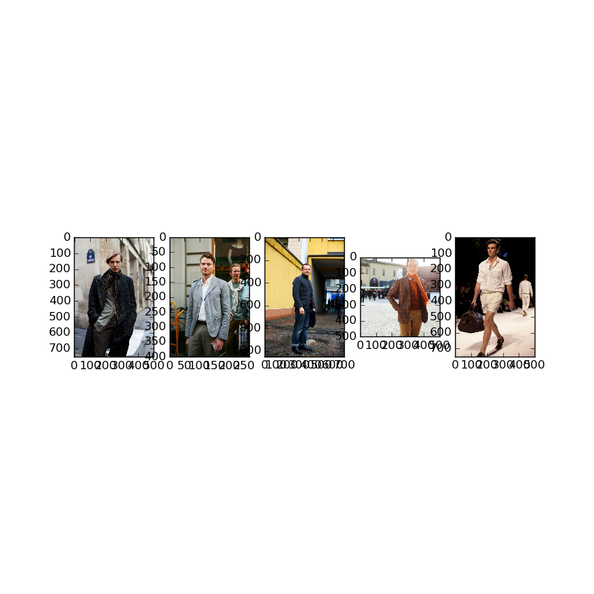
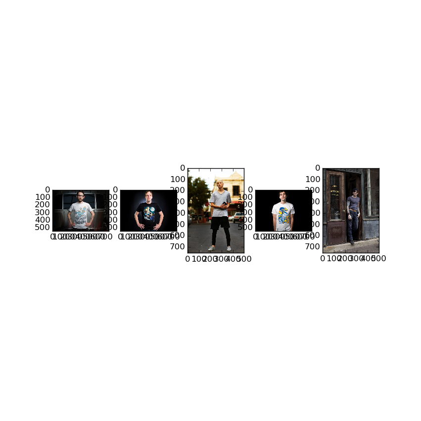

Clothing Recommender
====================

## 製品概要
Clothing Recommenderは、ユーザーの予定とその日の気温に合わせて着ていく服を推薦するアプリケーションである。  
朝起きたときアプリにその日の予定を入力すると、以下のようにその日着ていくべき服が推薦される。  
なお、気温はアプリケーションがWebから取得するため、ユーザーが指定する必要は無い。  

* 「最高気温10度の日に博物館に行く」という情況で推薦を行った結果


* 「最高気温25度の日に友達に会いに行く」という情況で推薦を行った結果


## 使い方
[動画](https://youtu.be/hI1ajJ7-dfk)

動画では2回説明を行っている。音声が無いほうがAndroid、音声での説明があるほうがWebで実行した様子である。  

### クローゼットをつくる  (初回使用時のみ)
アプリを起動したら、まずはあなた専用のクローゼットを用意します。  
あなたが持っている服の画像をシステムに登録してください。  
あなた専用のクローゼットがアプリ内に作成されます。  

### 服を選んでもらおう
朝起きたら、アプリを開いてその日の予定を入力してください。  
アプリがあなたに最適な服をあなたのクローゼットの中から選んでくれます。  

### 背景
#### 開発したきっかけ
##### 日々の悩みを解決したかった
```
お店で売っている商品から選ぶのは楽しくても、いざ着ようとすると...  
天気も予定も考えないといけないし... 自分の持っている服から選ぶのは大変  
今日はこのシャツが一番いいけど、おとといも着たし....  
```

このような悩みを解決するために服を推薦するアプリケーションを開発しようと考えた。  

##### 研究分野としても面白い
上記の課題を解決するには、予定と気温から最適な服を推薦するためのモデルを構築する必要がある。また、独自の推薦アルゴリズムを必要とし、ライブラリやAPIのラッパーを作るだけでは解決できないため、非常に興味深い課題であるといえる。  

### 製品説明
朝起きたときに「どの服を着ていこうか」と悩むことが多い人に利用してもらいたいアプリケーションである。  
#### 特長1
ショッピングに出かけたいときにはおしゃれな服を、博物館などのフォーマルな雰囲気の場所に行くときにはフォーマルな服を提示することができる。  
#### 特長2
気温も同時に考慮して服を推薦してくれるため「暖かい部屋で服を着て、いざ出発してみたら意外と寒かった！」といった経験を減らすことができる。  

#### 先行研究や既存の製品との比較
「予定に応じて推薦を行うアプリケーション」は、調査した限り他に存在しない。  
以下に類似製品と先行研究を示す。  

* [Style Casters](http://techcrunch.com/2009/10/06/geo-fashion-comes-to-the-iphone-with-stylecasters-clothing-recommendation-app)  
その日の天気に合わせて服の推薦を行う。恐らく予定に応じた推薦は行っていない。
* [Magic Closet](http://www.lv-nus.org/papers/2012/magic_closet-MM12.pdf)  
予定に合わせて全身の服のセットを推薦する。内部で姿勢推定などを用いているためシステムとして非常に大規模であり、ハッカソン期間中に同等のものを作ることはまず不可能であった。学術研究としてのみ存在し、アプリケーションとして公開されているものではない。

#### ハッカソンで開発した独自機能・技術
本アプリケーションでは独自の推薦アルゴリズムを用いており、ここではその詳細な説明を行う。  

本アプリに求められる機能は大きく分けて以下の2つである。   

1. ユーザーの服をデータベースに登録すること
2. アプリ利用時にその日のユーザーの予定と気温を考慮して服を推薦すること

1は画像をデータベースに登録するだけで実現できる。  
2を実現するためには、ユーザーの予定とその日の気温から、その日ユーザーが着るべき服へのマップを作ることが求められる。  
このマップは大きく2つの部分に分割できる。

1. ユーザーの予定を入力すると、それに基づいて最適な服のイメージを出力する
2. 1で出力されたイメージに最も似ている特徴を持った服を探す  

より詳細に言い表すと、

1. アルゴリズムに入力された予定と気温から「今日は寒いから分厚い服がいいかな」「博物館に行くからフォーマルな感じの服が欲しい」などというように着るべき服のイメージを作る
2. 1で作ったイメージに最もよく当てはまる服をユーザーのクローゼットから選び出す  

という2段階に分けられる。  
次に、1と2それぞれのマップの内容と、服のイメージ(特徴量)についてより詳細に述べる。  

#### 1. ユーザーの予定から服の特徴量へのマップ  
ここでは「ユーザーの予定と気温」という情報をまとめて「シチュエーション」という単語で表すこととする。

シチュエーションと最適な服のイメージそれぞれを多次元のベクトルで表現できたとすると、シチュエーションから服のイメージへのマップは多次元ベクトルから多次元ベクトルへのマップとみなすことができる。  
ある服と、それを着ていったときのシチュエーションを用意し、それぞれをベクトルで表現する。入力にシチュエーション、目標値に服のイメージを与え、[決定木回帰モデル](http://scikit-learn.org/stable/modules/generated/sklearn.tree.DecisionTreeClassifier.html)を学習させることでこのマップを作成した。  
なお、ここで服のイメージと言っているものは実際には服から抽出した特徴量のことである。

決定木への入力は以下のような形式になっている。  

```
[気温, ショッピング, ウォーキング, 学校, 仕事, デート, ...]
```

入力ベクトルの要素のうち、気温は実数で表現する。各予定のうち、該当するものは1、しないものには0を立てる。  
例えば気温20度の日にウォーキングをした場合、  

```
[20.0, 0, 1, 0, 0, 0, ...]
```

というベクトルが入力される。  
出力の目標値は与えられたシチュエーションにもっともふさわしい服のイメージ(特徴量)である。  

#### 2. 1で出力された特徴量に最も近い特徴を持った服へのマップ
上の決定木によって出力された服のイメージに最も近い服を検索する。  
システム内のユーザーのクローゼットにある服からそれぞれ特徴量を抽出し、服を多次元ベクトルで表現すれば、[KNN(k近傍探索)](http://scikit-learn.org/stable/modules/neighbors.html)による特徴検索によって高速に検索を行うことができる。  

#### 服のイメージ(特徴量)
気温や予定と関連が強い特徴を服から抽出できれば、学習が容易になり、精度の向上も期待できる。たとえば、暑い日には半袖の薄い生地の服を、寒い日には長袖の分厚い生地の服を着ることが多い。また、一般にフォーマルな場所(仕事や式典など)には分厚めの生地や質の良い生地を、そうでない場所には比較的薄めの生地の服を着ていく傾向がある。つまり、服が長袖かどうかや生地の素材といった情報は気温や予定と関連があり、これらの情報を特徴として利用するとモデルの学習が容易になる。  

次にそれぞれの情報を抽出する方法について考える。    
長袖かどうかを判定するには一般物体認識の技術が必要であり、モデルの学習コストが非常に高くなってしまう。一方、生地の質感や素材は画像の表面からテクスチャ特徴量によって得ることができ、この特徴量の抽出方法は既に確立されている。  
テクスチャ特徴量を抽出する方法はいくつかあり、[MR8 filter](http://www.robots.ox.ac.uk/~vgg/research/texclass/with.html)など、学習器と組み合わせると高い性能を出せるものも存在する。今回は開発期間が短かったため、scikit-imageライブラリに同梱されている[LBP(Local Binary Pattern)](http://scikit-image.org/docs/dev/auto_examples/plot_local_binary_pattern.html)を特徴量として用いた。  

### 活用した技術
上記をまとめると、活用した技術は以下の3つである。  
* [KNN(K近傍探索)](http://scikit-learn.org/stable/modules/neighbors.html)
* [決定木回帰](http://scikit-learn.org/stable/modules/generated/sklearn.tree.DecisionTreeClassifier.html)
* [LBP(Local Binary Pattern)](http://scikit-image.org/docs/dev/auto_examples/plot_local_binary_pattern.html)

#### API・データ
* 決定木回帰モデルの学習データとして[ClothingAttributeDataset](http://web.stanford.edu/~hchen2/datasets.html#clothingattributedataset)を用いた。

#### フレームワーク・ライブラリ・モジュール
* [scikit-image](http://scikit-image.org/)  
画像のグレースケール化などの汎用的な処理を行ったり、HoG(Histogram of Oriented Gradients)などの代表的な特徴量を抽出したりすることが可能である。
今回はLBP特徴量を抽出することと、LPB特徴量を抽出する前の処理として服画像の輝度の正規化に利用した。

* [scikit-learn](http://scikit-learn.org/)  
決定木回帰モデルやKNNの他にもさまざまな機械学習アルゴリズムが実装されている。


### 課題と今後の展望
#### 課題
* テクスチャ特徴量を取得するべき位置をアプリに自動で認識させたい    
ユーザーが撮影した画像のうち、服以外の部分からテクスチャ特徴量を抽出してしまうとうまく推薦を行うことができなくなってしまう。  
画像中のどの範囲が服なのかを判別するのは非常に難しい問題であり、[PaperDoll](http://vision.is.tohoku.ac.jp/~kyamagu/research/paperdoll/)などの特殊な技術を必要とするため、現段階では画像中のどの範囲に服があるかを識別することができていない。テクスチャ特徴量を取得するべき座標を指定する作業はユーザーに任せており、自動化できていない。  

* 服の組み合わせを考慮できていない  
本システムではシャツの画像を用いて学習を行うとシャツの推薦ができ、ズボンの画像を用いて学習を行うとズボンの推薦を行うことができる。しかし、パーカーに合うズボンを推薦するなどといった、各パーツの組み合わせを考慮した推薦を行うことはできていない。  

* 地域を考慮して学習データを選ぶ  
決定木回帰に与える服の特徴量は、欧米の服のデータセットから抽出したものを用いている。欧米の服のデータセットを用いて学習した決定木にシチュエーションを入力すると、欧米で着るのにふさわしい服の特徴量が出力されてしまう。日本でアプリを利用するには別のデータセットで学習する必要がある。  

* 予定の種類を追加するたびに再学習を強いられる  
決定木への入力ベクトルは予定に対応する要素に1を立てるようになっている。しかし予定の種類が増えるとベクトルの要素数もともに増えるため、入力ベクトルの形式が変わってしまう。入力データ形式が変われば当然モデルを再学習する必要性があるため、予定の種類を追加するたびにモデルを再学習することになってしまう。  

#### 展望
例えばユーザーが博物館に行くことになったときに、ユーザーのクローゼットに博物館に着て行くのにふさわしい服が無かったとき、ショッピングサイトの服の中からふさわしいものを選び、ユーザーに提示することによって、服の販売につなげることもできる。  
